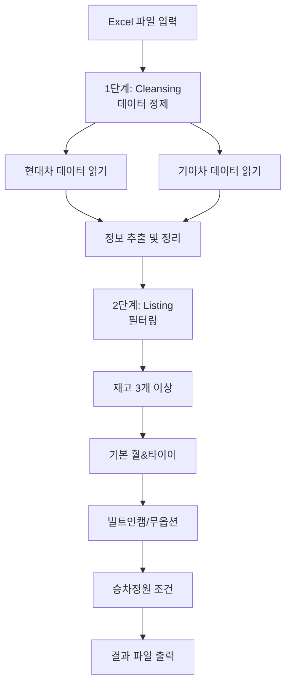

# 📖 사용자 가이드

현대/기아 재고 데이터를 필터링하는 자동화 도구 사용 가이드입니다.

---

## 📋 목차

1. [프로젝트 개요](#1-프로젝트-개요)
2. [입력 데이터](#2-입력-데이터)
3. [필터링 조건](#3-필터링-조건)
4. [출력 데이터](#4-출력-데이터)
5. [실행 방법](#5-실행-방법)
6. [문제 해결](#6-문제-해결)

---

## 1. 프로젝트 개요

### 목적

현대자동차와 기아자동차의 재고 데이터를 받아서, 특정 조건에 맞는 차량만 골라내는 자동화 도구입니다.

- 재고가 충분한 차량만
- 기본 휠&타이어가 장착된 차량만
- 빌트인캠이 있거나 옵션이 없는 차량만
- 특정 모델은 특정 인승만

### 처리 흐름

프로젝트는 크게 **2단계**로 나뉩니다:



1. **Cleansing (정제)**: 원본 Excel 파일에서 필요한 정보를 뽑아내고 정리합니다
   - 현대차와 기아차 데이터를 각각 읽어서 모델명, 트림, 연식, 연료, 옵션 등을 추출
   - 두 브랜드 데이터를 하나로 통합
2. **Listing (필터링)**: 정리된 데이터에서 원하는 조건에 맞는 차량만 골라냅니다
   - 5가지 필터링 조건을 순서대로 적용
   - 각 단계마다 몇 대가 남았는지 표시

---

## 2. 입력 데이터

### 필요한 파일

프로젝트를 실행하려면 다음 **2개의 Excel 파일**이 필요합니다:

1. **현대차 재고 파일**: `재고리스트_현대_YYMMDD.xlsx`
2. **기아차 재고 파일**: `재고리스트_기아_YYMMDD.xls`

> `YYMMDD`: 날짜 (예: `250901` = 2025년 9월 1일)

### 파일 위치

두 파일은 모두 `data/raw/` 폴더 안에 있어야 합니다:

```
stock_filter/
└── data/
    └── raw/
        ├── 재고리스트_현대_250901.xlsx
        └── 재고리스트_기아_250901.xls
```

### 파일 구조

- **현대차**: Excel 파일 (.xlsx), 여러 시트로 구성 (차종별 데이터)
- **기아차**: Excel 파일 (.xls), `sheet1` 시트 하나에 모든 데이터
- **주요 컬럼**: 판매코드, 칼라코드, 재고, 차종, 옵션, 외/내장칼라, 가격 등

### 파일 준비 방법

1. 현대자동차와 기아자동차에서 제공하는 재고 리스트 Excel 파일을 받습니다
2. 파일명을 다음 형식으로 변경합니다:
   - 현대차: `재고리스트_현대_YYMMDD.xlsx`
   - 기아차: `재고리스트_기아_YYMMDD.xls`
3. 두 파일을 `data/raw/` 폴더에 넣습니다

---

## 3. 필터링 조건

다음 **5가지 조건**을 순서대로 적용합니다:

### 조건 1: 재고 3개 이상

- **의미**: 재고가 3대 이상인 차량만 선택
- **이유**: 재고가 너무 적으면 실제로 구매하기 어렵기 때문

### 조건 2: 기본 휠&타이어만

- **의미**: 기본 휠&타이어가 장착된 차량만 선택
- **특수 케이스**: 제네시스(GV70)는 18인치도 기본으로 간주
- **이유**: 추가 옵션 비용을 피하기 위해

### 조건 3: 빌트인캠 또는 무옵션만

- **의미**: 옵션이 없거나 빌트인캠만 있는 차량
- **제외**: 빌트인캠 외에 다른 옵션이 있는 차량은 제외

### 조건 4: 싼타페 하이브리드 5인승만

- **의미**: 싼타페 하이브리드 모델 중에서 5인승만 선택
- **제외**: 6인승, 7인승은 제외

### 조건 5: 팰리세이드 9인승만

- **의미**: 팰리세이드 모델 중에서 9인승만 선택
- **제외**: 7인승, 8인승은 제외

### 필터링 과정

필터링은 순차적으로 진행되며, 각 단계마다 몇 대가 남았는지 화면에 표시됩니다:

```
전체 데이터 → 재고 3개 이상 → 기본 휠&타이어 → 빌트인캠/무옵션 → 승차정원 조건 → 최종 결과
```

---

## 4. 출력 데이터

### 결과 파일 위치

처리가 완료되면 다음 위치에 결과 파일이 생성됩니다:

```
results/stock_filtered_YYMMDD.xlsx
```

예: `results/stock_filtered_250901.xlsx`

### 시트 구조

결과 파일은 **3개의 시트**로 구성됩니다:

1. **`all` 시트**: 전체 차량 (필터 없음) - 전체 재고 현황 확인용
2. **`filtered` 시트**: 필터링된 차량 (전체 컬럼) - 조건에 맞는 차량 상세 정보
3. **`upload` 시트**: 업로드용 (필수 컬럼만) - 다른 시스템에 업로드할 때 사용

### 주요 컬럼

- `code_sales_a/b`: 판매 코드
- `code_color_a/b`: 색상 코드
- `stock`: 재고 수량
- `company`: 회사명 (현대/기아)
- `model`: 모델명
- `trim`: 트림명
- `year`: 연식
- `fuel`: 연료 타입 (가솔린/하이브리드/전기)
- `options`: 옵션 정보
- `wheel_tire`: 휠&타이어 정보
- `color_exterior/interior`: 외장/내장 색상
- `price`: 가격

---

## 5. 실행 방법

### 사전 준비

1. **가상환경 활성화** (처음 한 번만)
   ```bash
   source venv/bin/activate
   ```

2. **필요한 파일 준비**
   - `data/raw/` 폴더에 현대차/기아차 Excel 파일 넣기

### 실행 단계

#### 1단계: 프로그램 실행

```bash
python run.py
```

#### 2단계: 날짜 입력

프로그램이 실행되면 날짜를 입력하라는 메시지가 나타납니다:

```
📅 데이터 날짜 선택
현재 날짜: 250901
========================================
사용할 날짜를 입력하세요 (YYMMDD 형식, 엔터 = 오늘날짜 250901): 
```

**입력 방법**:
- **오늘 날짜 사용**: 엔터 키 누르기
- **특정 날짜 사용**: `YYMMDD` 형식으로 입력 (예: `250901`)

#### 3단계: 파일 확인

프로그램이 해당 날짜의 파일이 있는지 확인합니다. 파일이 없으면 다른 날짜를 선택하라는 메시지가 나타납니다.

#### 4단계: 처리 진행

프로그램이 자동으로 처리합니다:

```
🚗 재고 데이터 통합 처리 시작
📋 1단계: 통합 클렌징 시작...
✅ 현대차 전처리 완료! 500개 차량 데이터
✅ 기아차 전처리 완료! 300개 차량 데이터
✅ 통합 클렌징 완료! 총합: 800대

📋 2단계: 통합 리스팅 시작...
🔍 재고 3개 이상 필터 후: 650대
🔍 기본 휠&타이어 필터 후: 500대
🔍 빌트인캠 또는 무옵션 필터 후: 400대
🔍 승차정원 필터 후: 380대

📋 3단계: 최종 결과 파일 생성...
✅ 결과 파일 생성 완료: results/stock_filtered_250901.xlsx
```

#### 5단계: 결과 확인

처리가 완료되면 결과 파일 위치가 표시됩니다:

```
🎉 모든 처리 완료!
📁 결과 폴더: results/stock_filtered_250901.xlsx
```

### 실행 중 출력 메시지 해석

- **✅**: 성공적으로 완료됨
- **📋**: 처리 단계 시작
- **🔍**: 필터링 진행 중
- **📊**: 통계 정보
- **❌**: 오류 발생

---

## 6. 문제 해결

### 파일을 찾을 수 없을 때

**해결 방법**:
1. 파일이 `data/raw/` 폴더에 있는지 확인
2. 파일명 형식 확인: `재고리스트_현대_YYMMDD.xlsx`, `재고리스트_기아_YYMMDD.xls`
3. 날짜 형식 확인: 6자리 숫자 (`YYMMDD`)
4. 다른 날짜의 파일이 있다면 `y` 입력 후 날짜 변경

### 가상환경 오류

**증상**: `ModuleNotFoundError: No module named 'pandas'`

**해결 방법**:
```bash
# 가상환경 활성화
source venv/bin/activate

# 가상환경이 없으면 생성
python3 -m venv venv
source venv/bin/activate
pip install -r requirements.txt
```

### Excel 파일 읽기 오류

**해결 방법**:
1. 파일 경로 확인: `data/raw/` 폴더가 프로젝트 루트에 있는지 확인
2. 파일 형식 확인: 현대차 `.xlsx`, 기아차 `.xls`
3. 파일이 손상되지 않았는지 Excel로 열어서 확인

### 날짜 입력 오류

**해결 방법**: 6자리 숫자로 입력 (예: `250901`), 월은 01~12, 일은 01~31 범위 내에서 입력

### 필터링 결과가 0대일 때

**가능한 원인**:
- 재고가 3대 미만인 차량만 있음
- 기본 휠&타이어가 아닌 차량만 있음
- 빌트인캠/무옵션이 아닌 차량만 있음
- 승차정원 조건에 맞는 차량이 없음

**해결 방법**: `all` 시트를 확인해서 전체 데이터를 살펴보고, 필터링 조건이 너무 엄격한지 확인

---

**마지막 업데이트**: 2025년 9월
